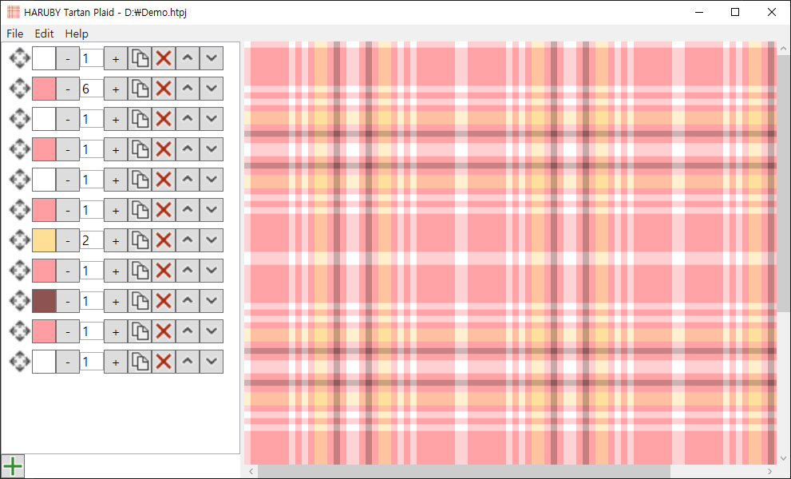

HARUBY Tartan Plaid
===

This software has been developed to create your own tartan pattern.  
The tartan is a kind of check pattern that origin from the Scotland.

The main purpose of this software is generating reference image or pattern texture for digital painting.  
Therefore, it does not consider actual weaving or dyeing.

Install
---

1. Please check [latest release](./../../releases/latest) to download.
1. Download attached `zip` file.
1. Extract the `zip` file to a folder.
1. Execute `exe` file in that folder.

> Supports only Microsoft Windows.  
> Please update your Windows if you have a problem to execute.

Usage
---

1. Click left below  button to add a new spool to the tartan.  
Please check tool-tips in the list item.

    *  is for moving the item. Drag & Drop to move the item.
    * `The second button` means color of the spool. Can change to click the button and color picker will showing.
    * `The next text box` means thread count of the spool. Can type in or +/- button to increase/decrease.
    * The next buttons are: 
        *  Copy
        *  Remove
        *  Move Up
        *  Move Down

1. Click top menu **Edit** and select **Settings**.  
Please check tool-tips in the name text.

    * `Thread Width` means pixel count per thread. It controls output size when export the tartan to image file.
    * `Repeat Count` means pattern's count in the result image.

    > The settings exists for each tartan. Not preserved to others.

1. Click top menu **File**, select **Export** and select any of image file.  
Finally export the tartan to an image file.

Demos
---

Please check [demos folder](./demos).  
Download `htpj` file and open it from the application.
